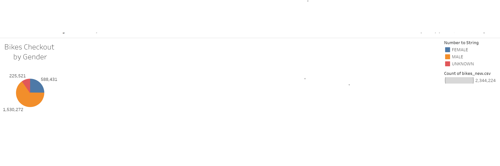
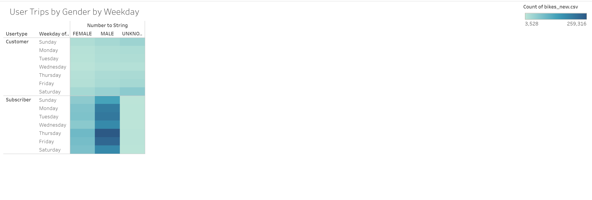

Bikesharing

Overview:
The purpose of this project is to visualize bike-sharing data from New York city. Tools mainly used to showcase this information is Tableau.
Using this tool, we are able to create individual visualizations, targeted dashboards, and stories around visualization, to explain the data.

The visualization data for the challenge can be found at : [link to dashboard](https://public.tableau.com/profile/rohan.ohol#!/)

Results:
Using tableau, we created the following visualizations;

1. Number of Rides by Gender
Greater number of Males use the service, compared to other genders

2. Bikes Servicing - Most used bikes
BikeID 38124 seems to be haven used most, and requires most servicing to keep it in shape.

3. Checkout Times for Users

4. Checkout Times by Gender

5. Trips by Gender (Weekday per Hour)

6. Trips by Weekday per Hour

7. Users Trip by Gender by Weekday

Summary:
Overall, we can tell that Citi Bike has a lot of male customers that utilize the services. 
We can see that mornings, between 6am and 9AM, and evenings between 4PM and 8PM are the times the services are used the most.
